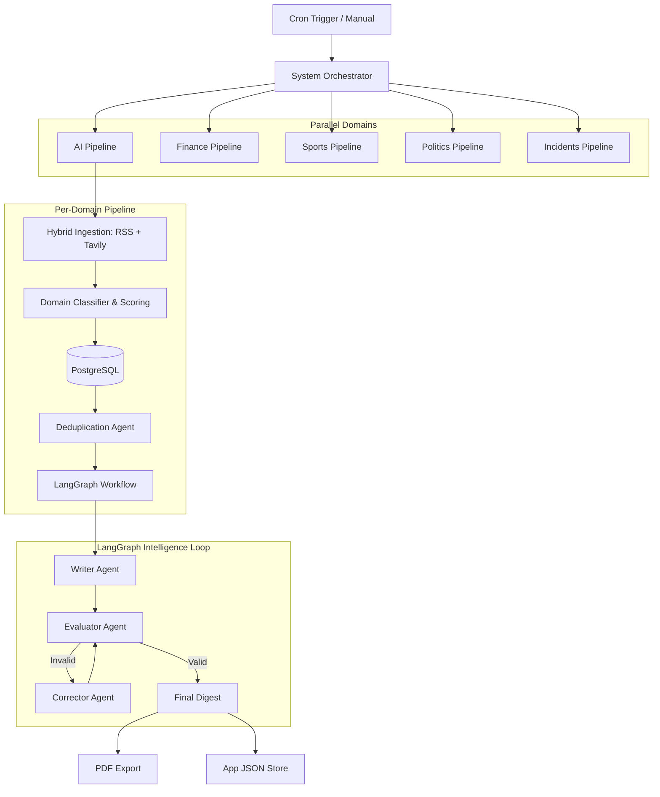

# System Execution Flow

## Step-by-Step
1. **Trigger**: System starts via `production_main.py` or Cron.
2. **Parallel Fan-out**: Orchestrator spawns tasks for each domain (AI, Finance, etc.).
3. **Ingestion**: For each domain, it fetches from RSS feeds and Tavily Search.
4. **Processing**: Articles are classified by percentage (e.g., 90% AI, 10% Finance) and scored for importance.
5. **Persistence**: Data is saved to PostgreSQL with a deduplication check.
6. **Intelligence**: LangGraph is triggered for each domain to generate a high-quality digest.
7. **Correction**: Evaluator checks for hallucinations; Corrector fixes them.
8. **Finalization**: Digests are exported to PDF and ready for API consumption.
